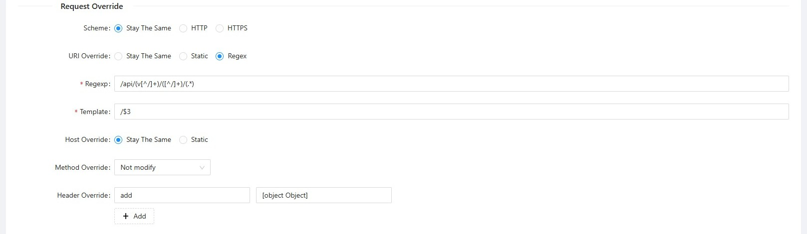
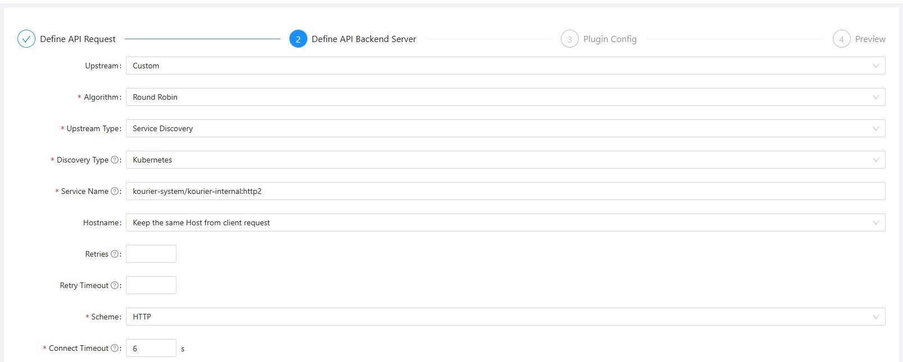
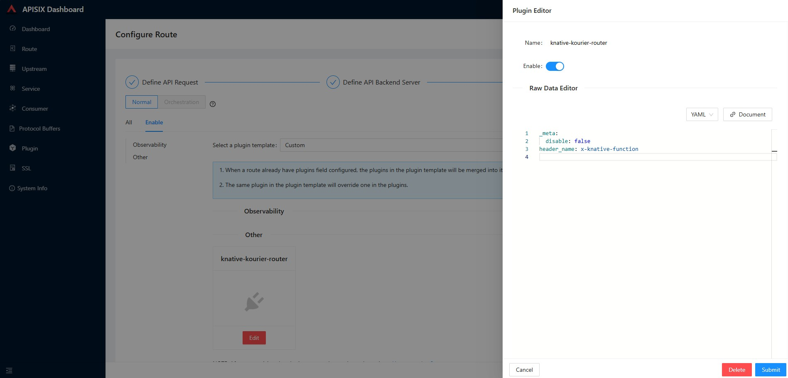

# APISIX Plugin for KNative Kourier Routing Layer

Custom APISIX Plugin to Support KNative Kourier Routing Layer for Host Header Alteration. This plugin is used to override the Host header to the value of the x-knative-function header to route the request to the correct function based on the x-knative-function header. This will allow users to create single route for each function in APISIX and utilize the Kourier routing layer to propagate the request.

## Installation

You need to add the plugin to the APISIX.

APISX Documentation: https://apisix.apache.org/docs/apisix/plugin-develop/#where-to-put-your-plugins

### For Binary Mode

You need to add the plugin in to a sub-directory and update the conf/config.yaml file to load the plugin.

- Create a new directory in the `apisix/plugins` directory.
- Add the plugin in to the new directory.
- Update the `conf/config.yaml` file to load the plugin.

For example, you can create a directory structure like this:

```
├── custom_plugins
│   └── apisix
│       └── plugins
│           └── knative-kourier-router.lua
```

Then add this configuration into your conf/config.yaml:

```
apisix:
  ...
  extra_lua_path: "/path/to/custom_plugins/?.lua"
  ...
  plugins:
  - ...
  - knative-kourier-router                            # Enable the plugin
```

If you are using decoupled mode, you need to do the same configuration for both data plane and control plane.

For APISIX Dashboard, you need to add the plugin in the `plugins` section.

```
plugins:
  - ...
  - knative-kourier-router                            # Enable the plugin
```

#### Update Plugin Schema

You need to update the plugin schema to load the schema of the custom plugin. APISIX currently does not support loading the schema for custom plugins automatically.

- You need to export the schema using control api.
- Upload the exported schema to the `conf` folder.

More Information: https://apisix.apache.org/docs/dashboard/FAQ/#4-after-modifying-the-plugin-schema-or-creating-a-custom-plugin-in-apache-apisix-why-cant-i-find-it-on-the-dashboard

### For Kubernetes

For Kubernetes deployment, you can mount the plugin as a configmap. Assuming you installed APISIX using official helm chart in the namespace `apisix`.

APISIX Helm Chart: https://github.com/apache/apisix-helm-chart/tree/master/charts

**Step 1: Create the configmap**

Paste the content of the plugin to the configmap as follows.

```
apiVersion: v1
kind: ConfigMap
metadata:
  name: knative-kourier-router-plugin
data:
  knative-kourier-router.lua: |
    local core = require("apisix.core")
    ...
```

Apply the configmap. 

```
kubectl apply -f knative-kourier-router-plugin.yaml -n apisix
```

**Step 2: Install APISIX**

Below is the values you need to update in the `values.yaml` file to enable the plugin.

```
apisix:
  customPlugins:
  enabled: true
  luaPath: "/opts/custom_plugins/?.lua"
  plugins:
  - name: knative-kourier-router
    configMap:
      mounts:
        - key: knative-kourier-router.lua
          path: "/opts/custom_plugins/apisix/plugins/knative-kourier-router.lua"
      name: knative-kourier-router-plugin
  plugins:
  - knative-kourier-router
```

Read more about the values applicable to the helm chart here: https://github.com/apache/apisix-helm-chart/tree/master/charts/apisix


**Step 3: Export Schema**

Port forward the `apisix` pod, control port and visit this api via browser `http://localhost:9090/v1/schema`. You can download the schema file.

Create a configmap using the schema file as follows:

```
apiVersion: v1
kind: ConfigMap
metadata:
  name: apisix-plugin-schema
data:
  schema.json: |
     {"plugins":{"ext-...
```

Apply the configmap.

```
kubectl apply -f apisix-plugin-schema.yaml -n apisix
```

Restart APISIX to apply the changes.

**Step 4: Restart APISIX Dashboard**

Below is the values you need to update in the `values.yaml` file to enable the plugin.

```
config:
  schema:
    configMap:
      name: apisix-plugin-schema
      key: schema.json

plugins:
- knative-kourier-router
```

### Setup Plugin

Login to APISIX dashboard and start setting up your route.

In the plugins section, you need to configure 2 plugins to enable knative routing.

For the below sample configuration, let's assume the url format is `https://example.com/api/v1/<FUNCTION_NAME>/<ACTUAL_URL>`. 

Above url should be transformed to `https://example.com/<ACTUAL_URL>` and with host header of value `<FUNCTION_NAME>.default`. Proxy rewrite plugin will be used to breakdown the url and construct the url required for knative function and knative-kourier-router-plugin will be used to alter the host header. 

In proxy rewrite plugin, the extracted function name will be added to `x-knative-function` custom header to be used by knative-kourier-router-plugin.

**Step 1: Add Proxy Rewrite**

Enable proxy rewrite and apply below configuration to reformat the url and extract the function name.

```
headers:
  add:
    x-api-version: $1
    x-knative-function: $2.default
regex_uri:
  - /api/(v[^/]+)/([^/]+)/(.*)
  - /$3
```

**Step 2: Add KNative Kourier Router Plugin**

Enable knative-kourier-router-plugin to alter the host header.

```
header_name: x-knative-function
```

Note: If the URL contains the namespace `default` you can remove the `.default` in proxy rewrite plugin. 

### Examples

Plugin configuration under a service level can be found in [Sample Service](./docs/sample-service.yaml)

Plugin configuration under a route can be found in [Sample Route](./docs/sample-route.yaml)

#### Screensots of Route Configuration in APISIX Dashbaord

Proxy rewrite configuration in route definition.



Define API backend server as kourier in route.



Route plugin definition.


